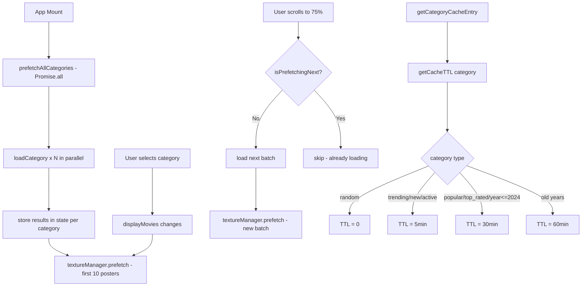

# מסמך עיצוב: אופטימיזציית טעינת פוסטרים

## סקירה כללית

פיצ'ר זה מוסיף שלוש שכבות של אופטימיזציה לטעינת פוסטרים ב-HoloCinema TV:

1. **מדיניות TTL חכמה** — `categoryCache.ts` מקבל פונקציה `getCacheTTL(category)` שמחזירה TTL שונה לפי סוג הקטגוריה.
2. **טעינה מקבילית** — `App.tsx` טוען את כל הקטגוריות במקביל בהפעלה ראשונה, ומפעיל prefetch של תמונות אחרי כל טעינה.
3. **שיפורי TextureManager** — גודל מטמון גדול יותר, מקביליות גבוהה יותר, ו-`prefetchPriority()` לתמונות קרובות למצלמה.

---

## ארכיטקטורה



---

## רכיבים וממשקים

### `src/utils/categoryCache.ts` — שינויים

#### פונקציה חדשה: `getCacheTTL`

```typescript
export const getCacheTTL = (category: string): number => {
  if (category === 'random') return 0;
  if (['trending', 'new_releases', 'recently_active'].includes(category)) return 1000 * 60 * 5;
  if (['popular', 'top_rated'].includes(category)) return 1000 * 60 * 30;
  const year = parseInt(category, 10);
  if (!isNaN(year) && year <= 2024) return 1000 * 60 * 30;
  if (!isNaN(year) && year < 2020) return 1000 * 60 * 60;
  return CATEGORY_CACHE_TTL_MS; // fallback: 15 minutes
};
```

#### שינוי ב-`getCategoryCacheEntry`

הפרמטר `ttlMs` יקבל ברירת מחדל מ-`getCacheTTL(category)` במקום מ-`CATEGORY_CACHE_TTL_MS`. הפונקציה תקבל פרמטר `category` אופציונלי:

```typescript
export const getCategoryCacheEntry = <T>(
  storage: StorageLike,
  cacheKey: string,
  now = Date.now(),
  ttlMs?: number,
  category?: string
) => {
  const resolvedTtl = ttlMs ?? (category ? getCacheTTL(category) : CATEGORY_CACHE_TTL_MS);
  // ...existing logic with resolvedTtl
};
```

---

### `src/utils/TextureManager.ts` — שינויים

#### קבועים מעודכנים

```typescript
private readonly maxCacheSize = 200;   // was 140
private readonly defaultConcurrency = 6; // was 4
```

#### מתודה חדשה: `prefetchPriority`

```typescript
async prefetchPriority(urls: string[], concurrency = 8): Promise<void>
```

טוענת URLs בעדיפות גבוהה (concurrency=8) לפני תור ה-prefetch הרגיל. ממומשת כ-`prefetch` עם concurrency גבוה יותר.

---

### `src/App.tsx` — שינויים

#### פונקציה חדשה: `prefetchAllCategories`

```typescript
const prefetchAllCategories = useCallback(async () => {
  const targets = [
    { target: 'movies', category: 'popular' },
    { target: 'movies', category: 'trending' },
    { target: 'series', category: 'popular' },
    { target: 'israeli', category: 'popular' },
    // ... all available categories
  ];
  await Promise.all(targets.map(t => loadCategory(t.target, t.category, 1, 20)));
}, []);
```

נקראת ב-`useEffect([], [])` (mount בלבד).

#### State חדש: `isPrefetchingNext`

```typescript
const [isPrefetchingNext, setIsPrefetchingNext] = useState(false);
```

מונע בקשות כפולות לאצווה הבאה.

#### שינוי סף הטעינה המוקדמת

מ-90% ל-75%:

```typescript
const scrollRatio = currentIndex / totalPosters;
if (scrollRatio >= 0.75 && !isPrefetchingNext && hasMore) {
  setIsPrefetchingNext(true);
  loadNextBatch().finally(() => setIsPrefetchingNext(false));
}
```

#### אינדיקטור "מערבב..." למצב אקראי

```typescript
{selectedCategory === 'random' && isLoading && (
  <div className="shuffling-indicator">מערבב...</div>
)}
```

---

## מודלי נתונים

### `CacheTTLMap` (לוגי, לא טיפוס חדש)

| קטגוריה | TTL |
|---|---|
| `random` | 0 ms |
| `trending`, `new_releases`, `recently_active` | 300,000 ms (5 דקות) |
| `popular`, `top_rated`, שנה ≤ 2024 | 1,800,000 ms (30 דקות) |
| שנה < 2020 | 3,600,000 ms (60 דקות) |
| כל שאר | 900,000 ms (15 דקות, ברירת מחדל) |

### שינויים ב-`TextureManager`

| שדה | לפני | אחרי |
|---|---|---|
| `maxCacheSize` | 140 | 200 |
| `defaultConcurrency` | 4 | 6 |
| `prefetchPriority()` | לא קיים | קיים, concurrency=8 |

---

## מאפייני נכונות (Correctness Properties)

*מאפיין הוא תכונה או התנהגות שצריכה להתקיים בכל הרצות תקינות של המערכת — הצהרה פורמלית על מה שהמערכת אמורה לעשות. מאפיינים משמשים כגשר בין מפרטים קריאים לאדם לבין ערבויות נכונות הניתנות לאימות אוטומטי.*

### מאפיין 1: TTL אפס עבור קטגוריה אקראית

*לכל* ערך TTL שמוחזר עבור הקטגוריה `"random"`, הערך חייב להיות `0`.

**Validates: Requirements 1.2, 6.4**

---

### מאפיין 2: TTL עולה עם ותק הקטגוריה

*לכל* שתי קטגוריות שנה `y1` ו-`y2` כאשר `y1 < y2 <= 2024`, ה-TTL של `y1` חייב להיות גדול מ-TTL של `y2` (קטגוריות ישנות יותר נשמרות זמן ארוך יותר).

**Validates: Requirements 1.5, 1.6**

---

### מאפיין 3: getCategoryCacheEntry מחזיר null עבור TTL=0

*לכל* רשומת מטמון שנשמרה עבור קטגוריה `"random"`, קריאה ל-`getCategoryCacheEntry` תמיד תחזיר `null` ללא קשר למתי הרשומה נשמרה.

**Validates: Requirements 1.7, 6.4**

---

### מאפיין 4: prefetch מדלג על URLs שכבר במטמון

*לכל* רשימת URLs שחלקם כבר נמצאים במטמון ה-TextureManager, קריאה ל-`prefetch()` לא תטען מחדש URLs שכבר קיימים במטמון.

**Validates: Requirements 3.4**

---

### מאפיין 5: LRU eviction שומר על גודל מטמון

*לכל* רצף של טעינות טקסטורות שמספרן עולה על 200, גודל המטמון לא יעלה על 200 ערכים, והטקסטורה הישנה ביותר (least-recently-used) תפונה.

**Validates: Requirements 5.1, 5.3**

---

### מאפיין 6: isPrefetchingNext מונע בקשות כפולות

*לכל* מצב שבו `isPrefetchingNext` הוא `true`, ניסיון נוסף להפעיל טעינת אצווה הבאה לא יוצר בקשת רשת נוספת.

**Validates: Requirements 4.2**

---

## טיפול בשגיאות

| תרחיש | התנהגות |
|---|---|
| קטגוריה נכשלת ב-prefetchAllCategories | לוג שגיאה, המשך טעינת שאר הקטגוריות |
| URL תמונה נכשל ב-prefetch | `catch(() => null)` — שגיאה מושתקת, ממשיכים |
| `hasMore = false` | לא מנסים לטעון אצווה נוספת |
| TTL = 0 (random) | תמיד מדלגים על המטמון, תמיד פונים לשרת |

---

## אסטרטגיית בדיקות

### בדיקות יחידה (Unit Tests) — Vitest

- `getCacheTTL` — ערכים ספציפיים לכל סוג קטגוריה
- `getCategoryCacheEntry` עם TTL=0 — תמיד מחזיר null
- `TextureManager.prefetch` — מדלג על URLs קיימים
- `TextureManager` LRU eviction — גודל מטמון לא עולה על 200

### בדיקות מאפיינים (Property-Based Tests) — Vitest + fast-check

כל בדיקת מאפיין תרוץ לפחות 100 איטרציות.

**תגית פורמט:** `Feature: poster-loading-optimization, Property N: <תיאור>`

| מאפיין | תיאור |
|---|---|
| Property 1 | TTL=0 עבור random |
| Property 2 | TTL עולה עם ותק שנה |
| Property 3 | getCategoryCacheEntry מחזיר null עבור TTL=0 |
| Property 4 | prefetch מדלג על URLs קיימים |
| Property 5 | LRU eviction שומר על גודל מטמון ≤ 200 |
| Property 6 | isPrefetchingNext מונע בקשות כפולות |

בדיקות יחידה ובדיקות מאפיינים משלימות זו את זו: בדיקות יחידה מכסות דוגמאות ספציפיות ומקרי קצה, בדיקות מאפיינים מאמתות נכונות כללית על פני קלטים רבים.
